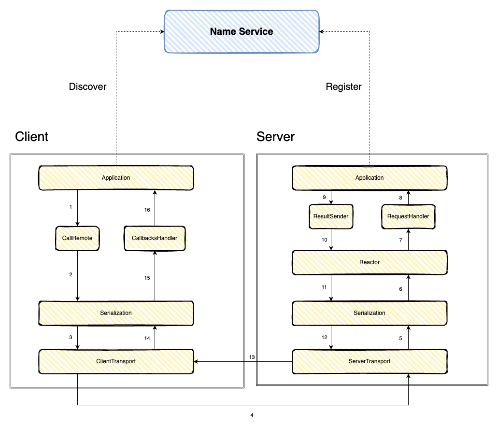

# DearmboatRPC

## Overview

DreamboatRPC framework is designed to provide a high-performance, scalable solution for distributed systems.

It integrates Protobuf for efficient data serialization, adopts a reactor thread model, which efficiently handles multiple concurrent connections using minimal threads, ensuring optimal resource utilization and supporting high concurrency with non-blocking I/O. 

Additionally, it incorporates an external name service, enabling dynamic service discovery and load balancing for distributed environments.

### Architecture



### Packet Layout


```cpp
struct RpcHeader
{
    unsigned short magic;
    unsigned short version;
    bool need_return;
    int seqno;
    int body_length;
    char servicename[MAX_RPC_NAME_SIZE];
};

struct RpcResultHeader
{
    int seqno;
    int body_length;
};

struct RpcBody
{
    char parameters[MAX_RPC_PARAMS_SIZE];
};
```

- `magic` is used by the server to quickly filter out data packets that don't belong to this RPC protocol.
- `need_return` indicates whether the server should return a function’s result.
- `seqno` represents the position of this RPC is at in sequence. The request and response of a single call share the same `seqno`, which helps the client distribute response to different RPC protocols.
- `body_length` the actual length in bytes of the body part.
- `servicename` is the name of the service used by the server to identify the request type and dispatch it to the corresponding routine.
- `parameters` contains the function parameters.

The Serialization layer will fill the `parameters` buffer of RpcBody.


## Prerequisites

This framework can only be run on Linux.

If you are using Windows or Macos, try WSL, Docker, or Cloud Development.

At first, install necessary tool chain.

On Ubuntu:

```bash
apt-get update && apt-get install -y \
    build-essential \
    cmake \
    g++ \
    clang \
    gdb \
    git \
    protobuf-compiler \
    libprotobuf-dev \
    libprotoc-dev \
    vim \
    curl \
    jsoncpp-devel
```

On CentOS:

```bash
yum update && yum install -y \
    build-essential \
    cmake \
    g++ \
    clang \
    gdb \
    git \
    protobuf-compiler \
    libprotobuf-dev \
    libprotoc-dev \
    vim \
    curl \
    jsoncpp-devel
```

## Setup

To install the package, you can simply clone the repository and use `cmake` command to build it.

```bash
git clone https://github.com/huangwx8/DreamboatRPC.git
cd DreamboatRPC

mkdir build
cd build

cmake ..
make
```

As a result, you should see two executable programs lying in build/ folder, Server and Client.

FYI, you can find the entries of these two program in source/apps/Server.cc and source/apps/Client.cc. You are allowed to modify these two files as you will to implement your own RPC applications.

## Usage

This section demonstrates how to implement a hello service to introduce the framework's usage.

To perform remote calls, you need an RPC proxy class on the client side to invoke the RPC call, and you need a specific implementation on the server side to execute the task and return the function result as well.

### Writing your .proto file

The first thing you need to do is to define the arguments of your service, in Dreamboat, we outsource this definition to `protobuf`.

For our hello service, the only argument we need is a `string`, which is the username of client.

```proto
message HelloReq {
  string username = 1;
}

message HelloRsp {
  string greeting = 1;
}
```

By execute `cmake ..` command, `protoc` is automatically called before compile, which will generate reflection code according to this proto file.

In reflection code, you can see c++ structs named `HelloReq` and `HelloRsp` produced by protoc, located in `*.pb.h`.

```cpp
class HelloReq : public ::google::protobuf::Message
{
    <collapsed>
private:
  ::google::protobuf::internal::ArenaStringPtr username_;
}
```

### Defining your Serivce Base Class

Inherit `RpcServiceBase`, set the `ServiceName` to uniquely identify the RPC service, and add a function declaration for the RPC function with its request and response.

```cpp
class HelloServiceBase : public RpcServiceBase
{
public:
    HelloServiceBase()
    {
        ServiceName = "Hello";
    }
    virtual ~HelloServiceBase() = default;
    virtual HelloRsp Hello(HelloReq req) = 0;
};
```

### Implementing your Service

Inherit the `HelloServiceBase` class and implement the specific RPC function on the server. One limitation is that you need to implement the `Handle` function, which is the unified entry point for RPC processing.

Then, in the server's `main`, start the server and register the service. The server will now be able to respond to incoming RPC requests.

```cpp
class HelloServiceImpl : public HelloServiceBase
{
public:
    HelloServiceImpl() = default;
    virtual ~HelloServiceImpl() = default;
    virtual RpcResult Handle(const RpcMessage& Context) override;
    virtual HelloRsp Hello(HelloReq req) override;
};

RpcResult HelloServiceImpl::Handle(const RpcMessage& Context)
{
    HandleRPC(HelloReq, HelloRsp, Hello);
}

HelloRsp HelloServiceImpl::Hello(HelloReq req)
{
    std::string greeting = "Hello, " + req.username();
    HelloRsp rsp;
    rsp.set_greeting(greeting);
    return rsp;
}

int main(int argc, char* argv[])
{
    // Create an RPC Server object
    RpcServer ServerStub({"127.0.0.1", 8888, "server.log"});

    // Construct an Hello service implementation
    HelloServiceImpl HelloImplementation;

    // Register Hello service
    ServerStub.RegisterService(&HelloImplementation);

    // Run the RPC Server, waiting for and handling requests
    ServerStub.Main(argc, argv);
}
```

### Implementing your RPC Call

#### Regular Usage

Inherit `HelloServiceBase` and implement the RPC proxy on the client side. You only need to add a macro inside the client-side proxy function.

Start a RPC client, make a service proxy object, use it to call the remote method, and then you will see the client print "Hello, Alice".

```cpp
class HelloServiceProxy : public HelloServiceBase
{
public:
    HelloServiceProxy() = default;
    virtual ~HelloServiceProxy() = default;
    virtual HelloRsp Hello(HelloReq req) override;
};

HelloRsp HelloServiceProxy::Hello(HelloReq req)
{
    return CallRPC<HelloRsp>(req);
}

int main(int argc, char* argv[])
{
    // Get an RPC Client object
    auto&& ClientStub = RpcClient::GetRpcClient({ "127.0.0.1", 8888, "client.log" });
    
    // Get an RPC Proxy object
    auto HelloPtr = ClientStub->GetProxy<HelloServiceProxy>();

    // Call remote service
    HelloReq req;
    req.set_username("Alice");
    HelloRsp rsp = HelloPtr->Hello(req);
    
    std::cout << rsp.greeting() << std::endl;

    return 0;
}
```

#### Using Callbacks

In the above app, the client calls a remote function and then wait for the response, that blocks the main thread.

If you want your RPC call to be more thread friendly, you are allowed to write a client program that receives and handles the response asynchronously.

```cpp
class AsyncHelloServiceProxy : public HelloServiceBase
{
public:
    AsyncHelloServiceProxy() = default;
    virtual ~AsyncHelloServiceProxy() = default;
    virtual HelloRsp Hello(HelloReq req) override;
private:
    static void HelloCallback(HelloRsp rsp);
};

HelloRsp AsyncHelloServiceProxy::Hello(HelloReq req)
{
    CallRPCAsync(req, &AsyncHelloServiceProxy::HelloCallback);
    return HelloRsp();
}

void AsyncHelloServiceProxy::HelloCallback(int return_value)
{
    std::cout << rsp.greeting() << std::endl;
}

int main(int argc, char* argv[])
{
    // Get an RPC Client object
    auto&& ClientStub = RpcClient::GetRpcClient({ "127.0.0.1", 8888, "client.log" });
    
    // Get an RPC Proxy object
    auto HelloPtr = ClientStub->GetProxy<AsyncHelloServiceProxy>();

    // Call remote service
    HelloReq req;
    req.set_username("Alice");
    HelloPtr->Hello(req);

    // Grace period
    sleep(1);
    
    return 0;
}
```

In this app, we added callback handling code to the proxy class to process the greeting sent by the server. Running this client will print "Hello, Alice" on an asynchronous thread through a callback, instead of the main thread.

### Service Discovery

In modern distributed system, we typically do not designate the address of RPC server on client side.

In order to provide better scalability, DreamboatRPC give you a more flexible way to discover the destination node to serve your client - centralized service discovery! Now you only need to know the address of name server and the name of the service you want to call. 

```cpp
int main(int argc, char* argv[])
{
    // A client factory, help you with dynamic addressing and load balancing.
    RpcClientFactory factory({ "127.0.0.1", 5000, "client.log" });

    // Discover a appropriate server and make a client stub
    auto&& ClientStub = factory.GetRpcClient("Hello");

    // Use ClientStub to do your job
}
```

## Layer Design

The layer division of this system is similar to trpc-cpp.

### 1. **Serialization Layer**

The Serialization Layer is used to convert complex data types (such as objects or structs) into a byte stream that can be transmitted over the network.

### 2. **Common Layer**

The Common layer implements general features like the RPC call interface, global UID management, asynchronous logging, and timer management.

### 3. **Runtime Module**

The **Runtime Module** provides the execution environment for the RPC framework.

#### 1. **Event Handler Abstraction**

The event handler abstraction enables the runtime to manage different events, such as incoming connect() request or RPC packets, without directly coupling the application logic to event-driven mechanisms.

#### 2. **Thread Pool**

The **Thread Pool** ensures that the framework can handle multiple concurrent RPC requests in a scalable and efficient manner.

#### 3. **Reactor Model**

The **Reactor Model** enables asynchronous, event-driven handling of I/O operations.

### 4. **Transport layer**

The Transport layer wraps Linux system calls for low-level socket communication, establishing a TCP channel between the server and client and passing received data to the Runtime layer.

### 5. **Client Layer**

Send requests for remote procedure calls (RPC) to the server and waiting response.

### 5. **Server Layer**

Map client requests to specific functions or methods on the server. Marshall execution of the requested remote procedure and sending the result back to the client.As well as error handling and sending appropriate failure responses.
